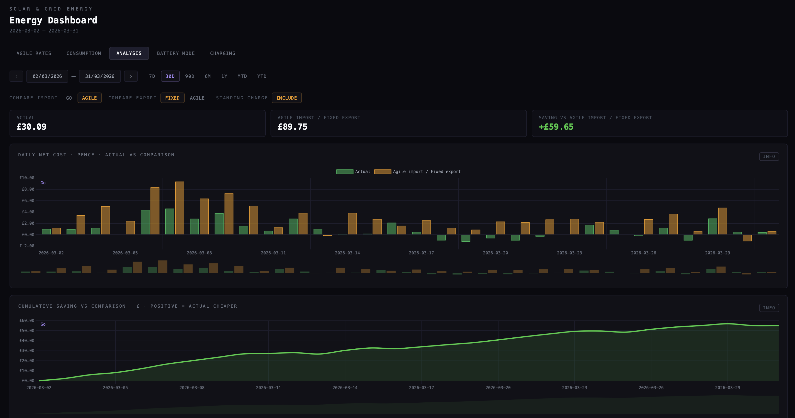

# energy-utility



A Go tool for harvesting solar inverter and smart meter data, storing it in object storage, and analysing energy costs — with a focus on answering: **"Would I have been better off on Octopus Agile?"**

## What it does

- Fetches 5-minute resolution solar/battery data from **SolaX Cloud** (reverse-engineered API)
- Fetches half-hourly consumption data and Agile pricing from the **Octopus Energy API**
- Stores everything in **Cloudflare R2** (S3-compatible object storage)
- Serves a web dashboard with charts for solar generation, battery behaviour, and tariff comparison

## Goals

The core question is whether switching from **Octopus Go** (fixed off-peak window) to **Octopus Agile** (half-hourly spot pricing) would save money, given a solar + battery setup.

The dashboard provides:

- **Solar & battery detail** — 5-minute resolution charts for any day: generation, consumption, import/export, battery SoC
- **Go vs Agile cost comparison** — per-slot and monthly breakdown of actual costs (Go) vs hypothetical costs (Agile), using real SMETS2 consumption data
- **Battery mode detection** — infers when the inverter switched from export-priority to self-use mode, based on daytime charging patterns
- **Charging priority optimisation** — models whether grid-charging during off-peak windows or relying on solar was the better call each day, with a decision boundary based on solar yield

## Architecture

```
cmd/harvest   — CLI: fetches SolaX + Octopus data into R2
cmd/serve     — HTTP server: HTMX + Chart.js dashboard on :8080
cmd/demo      — generates a self-contained HTML snapshot with data embedded

internal/octopus  — Octopus API client + R2 reader
internal/solax    — SolaX Cloud API client (AES-CBC crypto, JWT sessions)
internal/analysis — Go vs Agile cost comparison (per half-hour slot)
internal/store    — R2/S3 client wrapper
internal/config   — YAML config with env var overrides
infra/            — Pulumi (Go) for Cloudflare R2 bucket provisioning
```

Data is stored in R2 by date:

```
solax/raw/YYYY/MM/DD/daily-detail.json
octopus/agile-import/YYYY/MM.json
octopus/agile-export/YYYY/MM.json
octopus/consumption/import/YYYY/MM.json
octopus/consumption/export/YYYY/MM.json
```

## Setup

Copy `config.example.yaml` to `config.yaml` and fill in:

- **SolaX** credentials (email, password, site ID) and crypto keys (`SOLAX_CRYPTO_KEY` / `SOLAX_CRYPTO_IV` env vars)
- **Octopus** API key, MPANs, meter serials, region code, and historical Go/export rates
- **S3/R2** endpoint and bucket (credentials via `AWS_ACCESS_KEY_ID` / `AWS_SECRET_ACCESS_KEY` or `~/.aws/credentials`)

## Usage

```sh
make build

# Harvest data
./bin/harvest fetch-solax
./bin/harvest fetch-octopus

# Run the dashboard
./bin/serve

# Generate a static demo snapshot
./bin/demo
```

The dashboard runs at `http://localhost:8080`.
