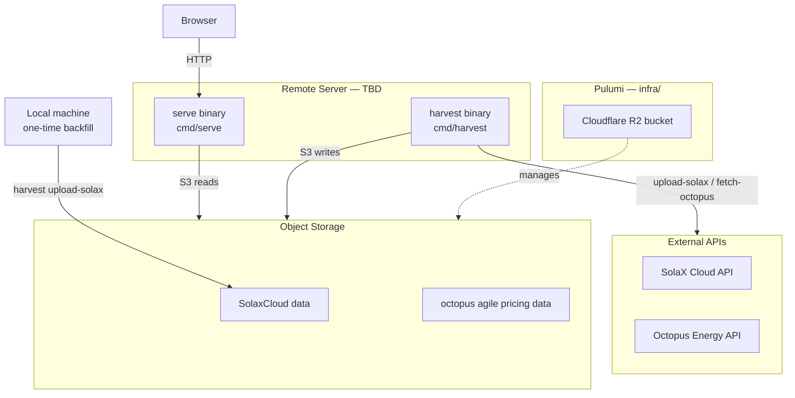

```mermaid
graph TD
    subgraph sources[External APIs]
        SolaX[SolaX Cloud API]
        OctopusAPI[Octopus Energy API]
    end

    subgraph remote[Remote Server — TBD]
        Harvest[harvest binary\ncmd/harvest]
        Serve[serve binary\ncmd/serve]
    end

    subgraph storage[Object Storage]
        RawSolax[SolaxCloud data]
        OctopusData[octopus agile pricing data]
    end

    Browser[Browser] -->|HTTP| Serve
    Serve -->|S3 reads| storage

    Harvest -->|upload-solax / fetch-octopus| sources
    Harvest -->|S3 writes| storage

    Local[Local machine\none-time backfill] -->|harvest upload-solax| RawSolax

    subgraph infra[Pulumi — infra/]
        Pulumi[Cloudflare R2 bucket]
    end

    Pulumi -.->|manages| storage
```
